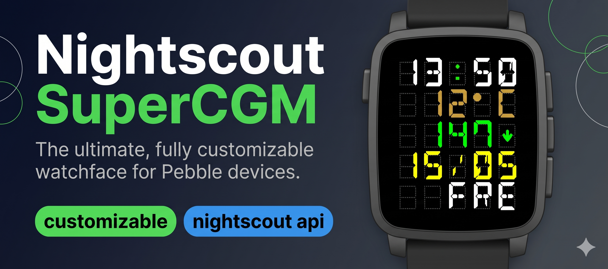

# supercgm-ns

**Flexible Pebble watchface for CGM + weather with a fully customizable 5-slot grid per row.**  
Designed for both color and black-and-white Pebble devices, including Round models.  
About **90 % of the code was developed collaboratively with GitHub Copilot (Claude Sonnet)**, making it especially easy to extend and maintain.

---

## ☕ Support

If this watchface saves you from checking your phone 50 times a day — consider buying me a Paulaner Spezi!

<a href="https://www.paypal.com/donate/?hosted_button_id=LGAZB9PR4YV5L">
  
</a>

---

## 📲 Quick Install

- **Rebble App Store**  
  Available directly in the Rebble store:  
  [https://apps.rebble.io/en_US/application/68c5e8d5474b97000932ae2c?query=Cgm&section=watchfaces](https://apps.rebble.io/en_US/application/68c5e8d5474b97000932ae2c?query=Cgm&section=watchfaces)

- **Direct Sideload (.pbw)**  
  Pre-built `.pbw` bundles are available under  
  [GitHub Releases](../../releases).  
  Download the latest release and sideload it using the Rebble phone app.

---

## ✨ Features

- **Customizable rows (per row choose one):**  
  Weather · Time · Date · Weekday · Battery · Nightscout BG · Steps · Heart Rate · BG Time · BG Delta · Rain next 3h
- **Per-row color customization**, plus in-range / high / low BG colors and ghost grid color
- **Ghost rendering tuned per platform** — color platforms use a visible ghost color; Aplite uses a subtle dotted skeleton; Diorite uses a visible grayscale ghost setting
- **Ghost density control** — configurable 1..5 dot density for the ghost background
- **Improved color UX in config:** native color picker + fallback palettes + live swatch preview + readable color labels
- **Live config simulator:** shows the selected watch shape, configured row types, row colors, sample values, ghost density, and a main/shake preview toggle
- **DSEG-based preview fonts** — the config simulator renders much closer to the actual watchface font than a generic monospace fallback
- **Phone-side background fetch** for Nightscout BG (manual interval or timestamp-synced mode)
- **Weather via Open-Meteo** (no API key needed, supports °C/°F) + rain probability for next 3 hours
- **Persistent storage** on watch and phone (survives restarts)
- **Platform-aware layout:**
  - Rectangular (Aplite/Diorite/Basalt/Flint/Emery): 5 rows
  - Legacy round (Chalk): 4 rows with tighter vertical spacing
  - Round 2 (Gabbro): tuned round layout with 5 rows

### 🔔 Alerts & Behaviour
- **Vibration on low BG** — 3 short pulses (configurable, 10-minute cooldown)
- **Vibration on high BG** — 2 short pulses (configurable, 10-minute cooldown)
- **Backlight on shake** — lights up the display when the watch is shaken (Pebble Time+)
- **Bluetooth reconnect notification** — single buzz + NOCON display when Bluetooth drops

### 📳 Shake to Reveal
Shake or tap the watch to overlay extra info for 5 seconds.  
Configurable content:
- Steps · Battery · Heart Rate · BG / CGM
- **BG Time** — time of last Nightscout reading
- **BG Delta** — signed delta from Nightscout (`bgdelta`, e.g. +6 / -4)
- **Rain next 3h** — rain probability forecast for your location
- The config simulator also has a dedicated **Shake preview** button so the second level can be checked before syncing to the watch.

---

## 🕹 Platforms

| Platform | Display | Rows |
|---|---|---|
| Basalt (Pebble Time) | Color | 5 |
| Chalk (Pebble Time Round) | Color, round | 4 |
| Gabbro (Pebble Round 2) | Color, round | 5 |
| Emery (Pebble Time 2) | Color | 5 |
| Aplite (Pebble / Pebble Steel) | B/W | 5 |
| Diorite (Pebble 2) | B/W | 5 |

---

## ⚙️ Configuration

Open the watchface settings from the Pebble/Rebble phone app.  
The settings page (`/config20`) adapts to the platform (row count, B/W palette, ghost visibility, and preview layout).  
Default language is **English** with an in-page **English/German language chooser**.
Presets include legacy models plus **Time 2** and **Round 2**.

The live simulator mirrors the selected watch variant:

- selected preset/platform
- row count and round/rect slot hiding
- row types and per-row colors
- example values for time, date, weekday, weather, BG, delta, steps, heart rate, BG timestamp, and rain
- ghost dot density
- main vs shake preview

---

## 🌙 Nightscout Integration

- Enter your base Nightscout URL; the app requests `<URL>/pebble`.
- If no BG is available → displays **NO-BG**; if connection lost → **NOCON**; if stale → **OLD-BG**.
- Trend arrows are drawn natively (↑, ↗, →, ↘, ↓ and double variants).
- BG delta is parsed from `bgs[0].bgdelta` and can be shown as row value.
- Sync mode uses `status[0].now` as server time and `bgs[0].datetime` as reading time to schedule the next fetch (`datetime + interval + 30s`).

---

## 🛠 Build & Development

Prerequisites: [Rebble SDK](https://developer.rebble.io/developer.pebble.com/sdk) (Pebble SDK 4.x) with `pebble` CLI.

**Quick start**
```bash
pebble build                                # Build app + regenerate message key artifacts
pebble install --phone <PHONE_IP>           # Install on phone
pebble install --emulator chalk             # Test on legacy Round emulator
pebble install --emulator gabbro            # Test on Round 2 emulator
pebble install --emulator emery             # Test on Time 2 emulator
pebble install --emulator diorite           # Test on B/W emulator
```

**Deploy config website**
```bash
./deploy-config.sh    # Uploads web/config/ to FTP /config20
```
Requires `lftp` (`brew install lftp`). FTP credentials are stored in `.ftpconfig` (gitignored).

Development tips:
- Phone code: `src/js/pebble-js-app.js`
- Watch code: `src/main.c`
- Web config: `web/config/`
- AppMessage keys: `package.json` → `pebble.appKeys` (source of truth for generated message keys)

Recent implementation notes:
- Ghost text layers are hidden; the ghost is rendered by a dotted hatch layer in `src/main.c`.
- Ghost density is configurable and sent as `GHOST_DENSITY`.
- The config simulator uses a DSEG webfont for near-watch-like rendering and falls back gracefully if the font is unavailable.
- The simulator includes a main/shake toggle, so you can preview the secondary row mapping before saving.

---

## 💡 Contributing

This project is **open source (MIT License)** and welcomes:
- New feature ideas
- Bug reports
- Pull requests and forks
- Other Devs to help building this watchface

About **90 % of the implementation was "Vibe-coded" with GitHub Copilot (Claude Sonnet)**,  
which means the majority of the logic was pair-programmed and iteratively refined together with an AI assistant.  
If you have an idea for a new function, feel free to open an issue or PR.

---


## 📜 License

This project is released under the [MIT License](LICENSE).  
You are free to use, modify, and distribute it, provided that the license terms are respected.
